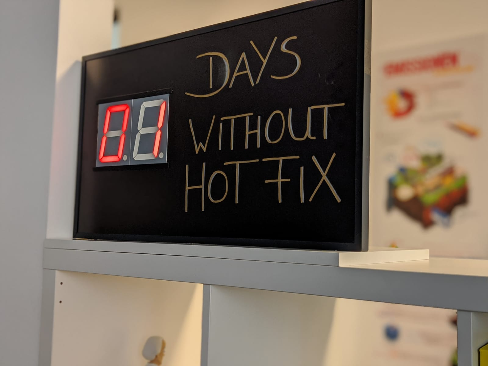

# Days without Hotfix on Raspberry PI (PHP)



inspired through


## Parts
- Raspberry Pi ([Pins](https://www.gtkdb.de/index_18_2672.html))
- [7 Segment Display](https://www.conrad.de/de/p/kingbright-7-segment-anzeige-rot-100-mm-7-6-v-4-v-ziffernanzahl-1-sa40-19ewa-160156.html)
- [Configurable Voltage Converter Module](https://www.conrad.de/de/p/entwickler-platine-buck-boost-1875989.html) 7.5V

## Start
Run ```php bin/run_server.php```. Make sure to adjust your Pin-Configuration in this file.

It will run a functional test, checking all numbers from 0...99. After, it blink 3 times the number `13`. Then an http-server starts at port 80

## Internal
This program is built on top of [reactphp/reactphp](https://github.com/reactphp/reactphp).

An event-loop will increase the number every 24 hours by one. 

If you trigger an request on `/startHotfix` the current number will blink until `/cancelHotfix` or `/finishHotfix` get called.

`/cancelHotfix` will cancel the blink (but remain current number).

`/finishHotfix` will cancel the blink and reset the number to zero. The 24 hour timer will be **restarted**.

`/cheat?number=5` will set the number to five, but won't affect the 24 hour timer.

## Other
Our jenkins detects if a hotfix-deployment was started and send a curl (`/startHotfix`) to the pi. The timer starts blinking, the build is running and after it's done another curl will be called (`/finishHotfix`). Timer stops blinking, number resets to zero. 

Hopefully a motivation for the Team :)